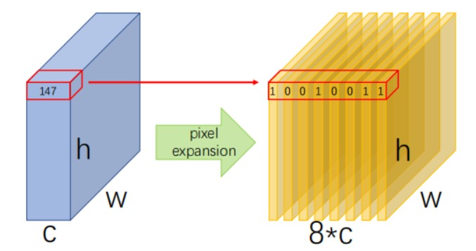

# What is this

This repo is a project for learning digital watermark algorithms based on Generative Adversarial Networks(GANs).

We successfully forgery (or simulate) **LSB**, **LSB Matching** and  **LSB Matching Revisited** (3 different watermark / steganograph algorithms) end-to-end.

The neural network used in this project is Pix2Pix and we change its loss function from binary cross-entropy (BCELoss, vanilla GANs) into mean square error (MSELoss, LSGANs). And the kernel of our model is to apply **pixel-expansion** while pre-processing which means to expand each pixel in images to binary form as shown below.



# How to Run the Codes

**ATTENTION: This repo doesn't contain `dataset` folder, you need to add your own data folder with paired original images and watermarked images.**

## 0x00 Download this repo
```
git clone https://github.com/SleepSupreme/GAN-for-Digital-Watermarks
cd <your-download-path>/GAN-for-LSB-Watermarks
pip install -r requirements.txt
```

## 0x01 Visualization by Visdom
```
python -m visdom.server
```
Then open [http://localhost:8097/](http://localhost:8097/) by browser.

## 0x02 Train
```
python train.py --dataroot ../datasets/lsb --name lsb-watermark --model pix2pix --netG unet_256 --netD basic --norm batch --n_epochs 10 --n_epochs_decay 0 --gan_mode lsgan --lambda_L1 10.0 --display_freq 100 --expand_bits --input_nc 3 --output_nc 3
```

## 0x03 Test
```
python test.py --dataroot ../datasets/lsb --results_dir ./results/ --name lsb-watermark --model pix2pix --netG unet_256 --num_test 50 --phase test --eval --expand_bits --epoch latest
```
