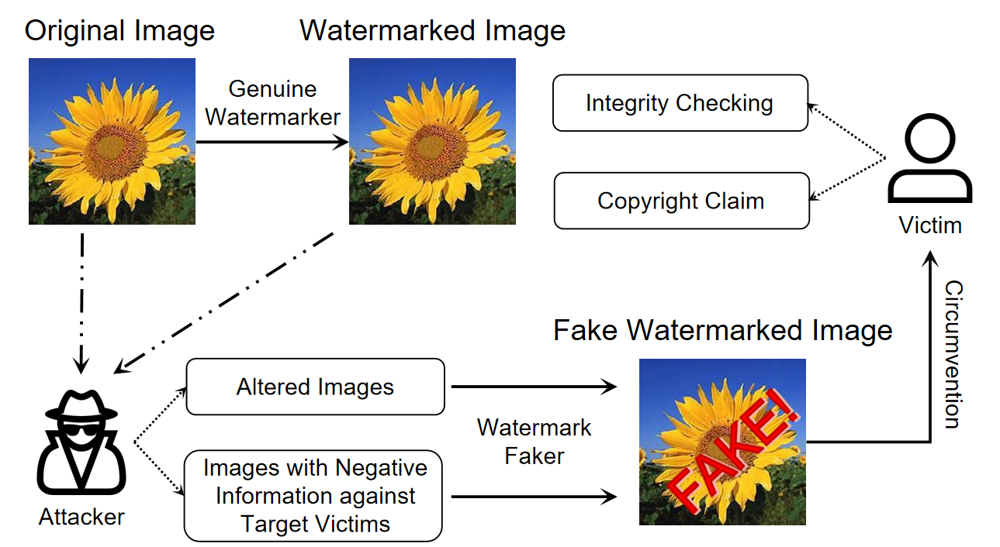
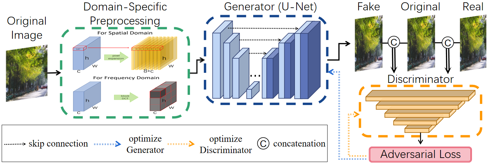

# Watermark Faker

This is the code of [*Watermark Faker: Towards Forgery of Digital Image Watermarking*](https://arxiv.org/pdf/2103.12489.pdf) (ICME 2021)

## Abstract
Digital watermarking has been widely used to protect the copyright and integrity of multimedia data. Previous studies mainly focus on designing watermarking techniques that are robust to attacks of destroying the embedded watermarks. However, the emerging deep learning based image generation technology raises new open issues that whether it is possible to generate fake watermarked images for circumvention. In this paper, we make the first attempt to develop digital image watermark fakers by using generative adversarial learning. Suppose that a set of paired images of original and watermarked images generated by the targeted watermarker are available, we use them to train a watermark faker with U-Net as the backbone, whose input is an original image, and after a domain-specific preprocessing, it outputs a fake watermarked image. Our experiments show that the proposed watermark faker can effectively crack digital image watermarkers in both spatial and frequency domains, suggesting the risk of such forgery attacks.

## Motivation
Illustration of application scenarios of forgery of digital image watermarking. The attacker could learn a watermark faker to circumvent target victims by using altered images or images with negative information against the victims.


## Basic Idea


## Framework



## Citation
```
@inproceedings{watermarkfaker2021,
  title={Watermark Faker: Towards Forgery of Digital Image Watermarking},
  author={Ruowei Wang, Chenguo Lin, Qijun Zhao, Feiyu Zhu},
  booktitle={IEEE International Conference on Multimedia and Expo (ICME)},
  year={2021}
}
```

## Acknowledgments
Our code is highly inspired by [pytorch-CycleGAN-and-pix2pix](https://github.com/junyanz/pytorch-CycleGAN-and-pix2pix).